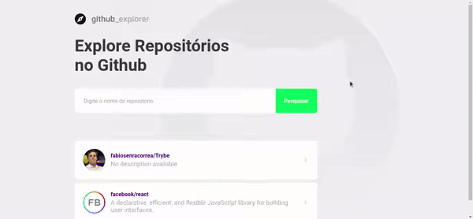

# Github Explorer

A single React SPA that lets you save your favorite repositories and check it's status (like stars, forks and issues) very quickly, while consuming GitHub's API and handling errors!

Designed to further develop my knowledge on React, Style Components and API consuming!

Check it out:

